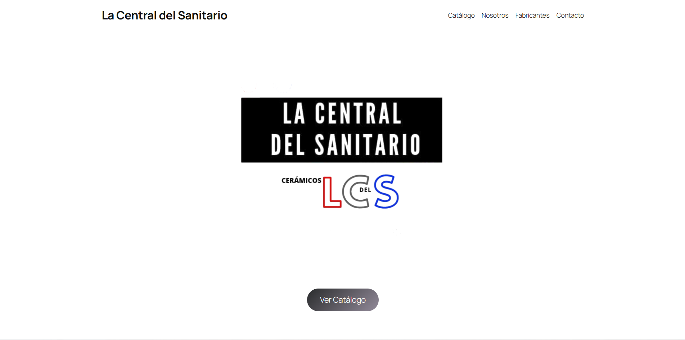

# La Central del Sanitario - Corporate Website 🏢

A responsive business website developed for a family sanitary and plumbing supply business, designed to establish its digital presence and showcase products,

---

## 📸 Preview

---

## 🌐 Project Status

* **Status:** Ready for production deployment (Domain acquired).
* **Local Development Environment:** WordPress (CMS) configured locally via XAMPP (Apache & MySQL).

---

## ✨ Key Features

* **Responsive Design:** Optimized layout for desktop, tablet, and mobile devices.
* **Product Catalog:** Structured presentation of sanitary
* **Direct Customer Channels:** One-click WhatsApp contact integration and inquiry workflows.
* **Optimized UI:** Clean navigation tailored to both retail customers and professional contractors.

---

## 🛠️ Tools & Technologies

* **CMS:** WordPress
* **Local Server:** XAMPP (Apache, MySQL)
* **Frontend:** Responsive layout & custom styling
* **Asset & Migration Management:** All-in-One WP Migration tooling

---

## 📂 Project Summary

* **Role:** Web Designer & Developer
* **Project Type:** Client Project (Family Business)
* **Objective:** Modernize brand identity and create a reliable bridge between digital visitors and in-store sales.